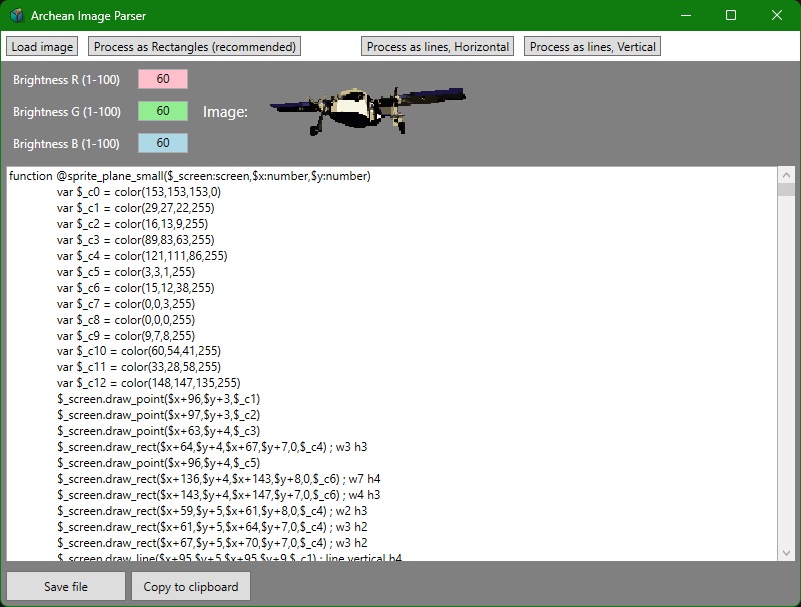

# Archean image parser
Parses an image and outputs a xenoncode draw function for Archean computers.

## Download options

- Windows version with graphical interface (GUI). Easy to use.
- Console versions for use on the command prompt for Linux and Windows. 
 
The console versions can be used either with command line arguments or in interactive menu mode if no arguments are passed.
Use -h to display available arguments.

## Use
- Load an image. I recommend a small image with areas of identical color if you want the best performance in game.
- Click Process as Rectangles (suitable for most uses)
- Click "Save file" or "Copy to Clipboard".
- Copy the function from the textbox to the into an Archean computer.
- Call on the generated function in your normal program.
- If the image is too bright or too dark, use the Brightness values in the program and generate the code again to update the color palette. By default the values are darker than the source image to combat overly bright colors on Archean computers

## Performance and color space

If you use an image with a limited color palette, the code can simplify identical areas into larger rectangles. "Identical" in this case means actually fully identical colors.
This is only achieved if you're drawing the image yourself, or process the image in Photoshop or similar to reduce the color palette (indexed colors).
A JPG source file, or an image with aliased (soft edges) will not give you an optimal result, since they will have many variations on almost the same color. GIF or PNG are better for optimizing and maintaining exact colors.

## Details
The image will be processed into a grid where each number is a color value from a generated palette.
This grid is then used to simplify the draw calls to lines and rectangles if there's a contiguous set of pixels with the same palette color.

If you have fewer unique colors in your image, fewer color palette variables are created, and there will be more opportunities to create simple shapes out of a chunk of pixels.
When converting an existing image like a photo with a wide range of colors, try converting it to an indexed color image to simplify it.

The finished function draws the points, lines and rects to a screen. If you use one hidden screen as your sprite storage, you can then copy that sprite region to your main screen on demand.
That way you only have to use the heavy generated function once for each image, and use the sprite library screen -> main screen copy when you need to draw it.

## Horizontal and Vertical processing
These modes only output straight lines and dots, no rectangles.
This is useful if you're creating a function with stretching capabilities, such as making a narrow sliver of a UI element that can be stretched to fill the bounds.

    Example, change this:

    function @sprite_buttonMiddle($_screen:screen,$x:number,$y:number)
	    var $_c0 = color(21,37,87,255)
    	var $_c1 = color(77,126,144,255)
    	var $_c2 = color(51,84,96,255)
    	$_screen.draw_line($x+0,$y+0, $x+2,$y+0, $_c0) ; line 2 
    	$_screen.draw_line($x+0,$y+1, $x+2,$y+1, $_c1) ; line 2 
    	$_screen.draw_line($x+0,$y+2, $x+2,$y+2, $_c2) ; line 2 

    To this:
    
    function @sprite_buttonMiddle($_screen:screen,$x:number,$y:number,$width:number) ; <<< add width argument
	    var $_c0 = color(21,37,87,255)
    	var $_c1 = color(77,126,144,255)
    	var $_c2 = color(51,84,96,255)
    	$_screen.draw_line($x+0,$y+0, $x+2+$width,$y+0, $_c0) ; <<< add $width to the second X variable to have the sprite stretch out to any size
    	$_screen.draw_line($x+0,$y+1, $x+2+$width,$y+1, $_c1)
    	$_screen.draw_line($x+0,$y+2, $x+2+$width,$y+2, $_c2)
        

## Pixel grid

If you're using the console version. you can output a grid of the pixels in the image, where each number represents the palette swatch used at that pixel. This could be used for writing different optimization algorithms.

## Console version arguments

**ArcheanImageParser imagefile outputfile [mode]**
**ArcheanImageParser imagefile outputfile [red green blue] [mode]**
The output file argument can be replaced by = to use the same name as imagefile + .xc

### Examples:
		ArcheanImageParser test.png out.xc
		ArcheanImageParser test.png =
		ArcheanImageParser test.png out.xc v
		ArcheanImageParser test.png out.xc 80 60 60 horizontal

If colors are omitted, the default value of 60 is used for all channels (60% brightness)

### Modes:
- rect        Rectangle mode, outputting an efficient mix of shapes for the shortest code
- horizontal  (or h) Outputs only horizontal lines and points
- vertical    (or v) Outputs only vertical lines and points
 -grid        Outputs the grid of pixels found in the image, numbers represent palette swatches. Does not output a draw function. This is used for building alternative algorithms.

### Available image formats
PNG, BMP, JPEG, GIF, TIFF, TGA, PBM, QOI, WEBP

### Error codes:
- OK = 0
- Quit = 1
- FileNotFound = 2
- FileError = 3
- ImageError = 4
- ProcessingError = 5
- OutputFileError = 6
- TooFewArguments = 7
- InvalidArguments = 8
